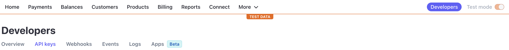
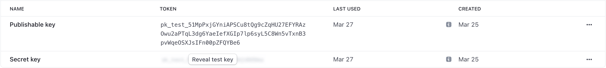

# HOW TO USE

1. Clone the repository and run `npm run i` or `yarn add`
2. Create `.env` file and paste

PORT=<`your port`>
 
DB_USERNAME=<`your DB username`>
 
DB_PASSWORD=<`your DB password`>
 
DB_DATABASE=<`your DB name`>
 
DB_HOST=<`your DB host`>
 
DB_PORT=<`your DB port`>
 
ACCESS_TOKEN_SECRET=<`secret access token`>
 
STRIPE_SECRET_KEY=<`stripe secret key`>
 
BASE_URL=<`your localhost server`>

3. For secret access token you can run `require('crypto').randomBytes(64).toString('hex')` on your node in terminal
4. For stripe secret key you can register in https://stripe.com and copy your stripe secret key

5. In your terminal run `npm run db:sync` or `yarn run db:sync` to create your database
6. Run the app with `yarn dev` or `npm run dev`
7. In your browser go to `/api-docs` to open the SWAGGER UI
